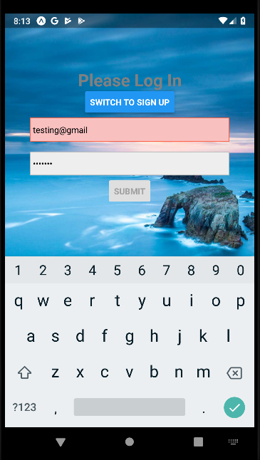

# Project app to create location based projects having Project Image to represent.

React Native App

0. This app is created from expo init my-app
1. run 'npm install' in the root folder to install all dependencies mentioned in package.json
1. Also make sure to run 'npm install' in functions folder.
1. run 'expo start'

Login Screen

Client side and server side validation

With proper validation

Signup

Signup Validation

Home Screen

Projects Screen

Project Detail Screen

Share Project

Logout

### Folder structure

--.expo
--%RESOURCE_DIR%
--assets
--components
--screens
--store
--utility

### Packages

- react
- react-native
- redux
- react-redux
- redux-thunk
- react-navigation
- fetch

For the backend
*firebase
*firebase authentication
\*firebase cloud services

### Sources

To learn more about the packages used in this project have given below:

---

React: https://reactjs.org/docs/getting-started.html
React-Native: https://facebook.github.io/react-native/docs/getting-started.html
Redux: https://redux.js.org/
Redux: https://blog.isquaredsoftware.com/presentations/2018-03-redux-fundamentals/#/0
React Redux: https://redux.js.org/basics/usagewithreact
React Navigation 3x: https://reactnavigation.org/docs/en/getting-started.html
Expo app: https://docs.expo.io/versions/v31.0.0/
Redux Thunk: https://github.com/reduxjs/redux-thunk
Fetch api: https://developer.mozilla.org/en-US/docs/Web/API/Fetch_API
